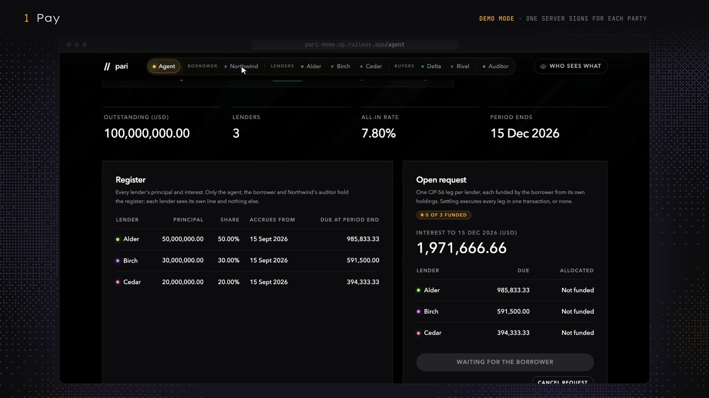

<div align="center">

<br/>

<picture>
  <source media="(prefers-color-scheme: dark)" srcset="docs/assets/logo-dark.svg" />
  
</picture>

<h1>pari</h1>

**The private ledger for syndicated loans, on Canton.**

Every lender paid in one transaction. Every trade settled delivery versus payment.<br/>
Each party sees only what it is entitled to. The agent never holds the money.

[](#tests)
[](docs/devnet.md)
[](https://docs.digitalasset.com)
[](#hackcanton-season-3)
[](LICENSE)

[**Demo video**](https://youtu.be/aPl_ziLIdzs) · [Live app](https://pari-demo.up.railway.app) · [Docs](https://pari-demo.up.railway.app/docs) · [DevNet run](docs/devnet.md) · [Decentralized agent](docs/governance.md)

</div>

---

## Demo video

<a href="https://youtu.be/aPl_ziLIdzs"></a>

**Watch it (3:28):** [youtu.be/aPl_ziLIdzs](https://youtu.be/aPl_ziLIdzs)

It shows the Revlon mistake, why a public chain can't hold a loan's secrets, the site and docs, and then the app: interest paid to every lender in one step, a loan traded delivery versus payment, a banned buyer refused, who sees what, the auditor's trail, the agent run by three operators, and the deal settling in Canton Coin on DevNet.

---

## What is Pari?

A syndicated loan has one **administrative agent**. It keeps the lender register, pays every lender, passes on information and records trades. Today that runs on email, PDFs and spreadsheets, and it fails in three ways:

- **Payments go wrong.** In 2020 Citibank, as Revlon's agent, meant to pay $7.8M of interest and wired about $900M of its own money instead.
- **Trades settle slowly.** A US par loan trade takes about 16 days to settle, chased by email.
- **A loan is full of secrets.** Each lender's position, inside information (MNPI), the borrower's list of banned buyers (the DQ list) and trade prices. A public chain would publish all of them.

**Pari puts the agent's books on Canton.**

| | |
|---|---|
| **Private** | Each lender holds its own position and sees nothing else. Buyers are screened against the DQ list without seeing it. MNPI reaches private-side lenders only. |
| **Atomic** | Interest and principal reach every lender in one transaction, to the cent, or none do. A trade moves the loan and the cash together. |
| **Non-custodial** | Every payment is a standard CIP-56 allocation funded by the payer. The agent executes it, but never holds or redirects the money, and can never pay more than is due. |
| **Auditable** | The borrower's auditor follows the register through every payment and trade, straight from the ledger, and can act on nothing. |
| **Decentralized** | With BitSafe's Decentralization Manager, the agent can run on three independent operators' nodes. Any two must confirm each action. |

---

## How a payment works

```
 Agent                  Borrower                     Canton ledger                  Lenders
   │                        │                              │                            │
   │  1. request interest   │                              │                            │
   ├───────────────────────▶│                              │                            │
   │                        │  2. fund every lender's leg  │                            │
   │                        │     one CIP-56 allocation    │                            │
   │                        │     each, from its own cash  │                            │
   │                        ├─────────────────────────────▶│                            │
   │  3. settle all legs, in one transaction               │                            │
   ├──────────────────────────────────────────────────────▶│  4. each lender is paid    │
   │                                                       │     its exact share,       │
   │                                                       │     from the borrower      │
   │                                                       ├───────────────────────────▶│
```

The cash moves from the borrower straight to each lender; the agent only executes. Every leg settles, or none does. A short payment is shared pro rata, and the unpaid part stays owed. A trade works the same way: the buyer funds its cash, the agent screens the buyer against the DQ list, and one transaction moves the position to the buyer and the cash to the seller.

---

## What it guarantees

Every claim is a Daml Script test in [`daml/pari-tests`](daml/pari-tests/daml/Pari/Test), or, for the governed agent, in [`daml/pari-governance-tests`](daml/pari-governance-tests/daml/Pari/Test/Governance.daml).

| Guarantee | Test |
|---|---|
| Closing funds the borrower from every lender in one transaction, or not at all | `Syndication: test_closing_funds_borrower_atomically`, `test_closing_fails_unless_fully_committed` |
| Each lender sees only its own position; the register stays with the agent, the borrower and the borrower's auditor | `Syndication: test_lenders_see_only_their_own_position` |
| Interest (ACT/360) is paid to every lender in one step, to the cent | `Interest: test_interest_paid_to_every_lender_in_one_step` |
| A short payment is shared pro rata, and the unpaid part stays owed | `Interest: test_short_payment_is_shared_pro_rata` |
| No lender can be favoured, and no lender can be left out | `Interest: test_borrower_cannot_favour_a_lender`, `test_every_lender_is_paid_or_none_is` |
| Trades settle delivery versus payment | `Trading: test_trade_settles_delivery_versus_payment` |
| Interest is split to the day when a loan changes hands | `Trading: test_interest_is_split_on_the_trade_date`, `test_full_exit_keeps_earned_interest` |
| A buyer on the borrower's DQ list is refused, without ever seeing the list | `Trading: test_dq_listed_buyer_is_refused` |
| The borrower never sees the trade price; buyer and seller never see each other's positions | `Trading: test_trade_privacy` |
| Principal moves only on the borrower's own notice, pro rata | `Principal: test_agent_cannot_originate_a_principal_payment`, `test_prepayment_is_shared_pro_rata` |
| No settlement can pay a lender more than its leg (the Revlon guard) | `Principal: test_settlement_cannot_pay_more_than_requested` |
| The agent never holds the money: every payment moves from payer to payee directly | `Authority: test_agent_never_holds_the_money` |
| A payment the agent cancels, or a trade it declines, moves nothing: the payer takes its own cash back | `Authority: test_cancelled_request_returns_the_borrowers_cash`, `test_declined_trade_returns_the_buyers_cash` |
| The agent cannot create, move or shrink a lender's position, or move tokens alone | `Authority` |
| MNPI reaches private-side lenders only, and only the lender can cross the wall | `Disclosure` |
| Only the borrower appoints its auditor, who follows the register through every payment and trade and can act on nothing | `Audit: test_only_the_borrower_appoints_the_auditor`, `test_auditor_follows_the_register`, `test_auditor_acts_on_nothing` |
| The auditor never holds a trade price, the DQ list or a document; once removed, it sees nothing new | `Audit: test_auditor_holds_no_price_dq_list_or_document`, `test_removed_auditor_sees_nothing_new` |
| A hundred lenders: the closing, an interest payment and a prepayment each settle in one transaction, to the cent | `Scale: test_a_hundred_lenders_settle_in_one_transaction_each` |
| The agent can be run by three independent operators: any two make it act, one alone moves nothing | `Governance: test_settlement_needs_two_of_three_operators`, `test_an_operator_alone_is_not_the_agent`, `test_operators_run_the_deal_two_of_three` |

Every choice and what it can move is in the [authority matrix](docs/authority-matrix.md). How each party's view stays private is in [architecture](docs/architecture.md).

---

## Live on the Canton DevNet

On 6 October 2026, the seeded deal ran through every step on the HackCanton DevNet node, **settling in real Canton Coin**: 13 of 13 end-to-end checks passed. Each payment is Canton Coin's own CIP-56 allocation, executed inside Pari's choice.

| Step | Update id | Canton Coin transfers |
|---|---|---|
| Closing: every lender funds the borrower | `12208b2861723bafb8434dff7a69629dcb59aef8202580aa9a33f6b744a6bdf14e71` | 3 |
| Alder sells 10M to Delta, delivery versus payment | `122073bf14f5ef5f0f638cc232a05e5692ac21c564d4e25fe68bd456f84ea792d902` | 1 |
| Interest paid short at 50%, shared by every lender | `122022c1e02108052e32727d90497d7cd8095b03d6bdfdf602ae1731532f54666879` | 4 |
| Northwind prepays 25M, pro rata | `1220a92e0e89dbb3651fc61488354b2c26bfa970c5c6b866b32cca967f932be1c451` | 4 |
| Next period, the unpaid half rolled in, paid in full | `122036c09e62744133141807ce9f671727a882a2543c7e860c365610df446b8a0628` | 4 |

Update ids are visible only to the parties in each transaction. How to run it yourself: [docs/devnet.md](docs/devnet.md).

---

## Try it

The live app runs Pari on its own Canton sandbox, with the demo deal seeded. Pick a party in the top bar and act as it.

| Screen | Link |
|---|---|
| The agent | [pari-demo.up.railway.app/agent](https://pari-demo.up.railway.app/agent) |
| The borrower (Northwind) | [pari-demo.up.railway.app/borrower](https://pari-demo.up.railway.app/borrower) |
| A lender (Alder) | [pari-demo.up.railway.app/lender/alder](https://pari-demo.up.railway.app/lender/alder) |
| Who sees what: every party's own ledger query, side by side | [pari-demo.up.railway.app/visibility](https://pari-demo.up.railway.app/visibility) |
| The auditor's trail, rebuilt from the ledger | [pari-demo.up.railway.app/auditor](https://pari-demo.up.railway.app/auditor) |
| Docs | [pari-demo.up.railway.app/docs](https://pari-demo.up.railway.app/docs) |

Every visitor shares one deal, and it starts fresh after each restart. The demo server signs as every party so one browser can play the whole deal, but each action is submitted as the one party entitled to it, so the ledger enforces the same authority it would with each party on its own node.

---

## Run it locally

**Prerequisites:** [dpm](https://docs.digitalasset.com) with Daml SDK 3.5.12, Java 17+, Node.js 20.

**1. Run every test**

```bash
make test
```

**2. Run the app on a local Canton sandbox**

```bash
make sandbox                      # terminal 1: a Canton sandbox with Pari loaded
make seed                         # terminal 2: the demo deal, party ids to web/.pari/cast.json
cd web && npm install && npm run dev
```

Open `http://localhost:3000/agent`. There is a screen for the agent, the borrower, each lender or buyer and the auditor, plus `/visibility`. Run `make seed` again at any time for a fresh deal.

**3. Check it end to end**

```bash
make smoke    # drives every write the app offers and checks every figure and privacy claim
make scale    # a hundred lenders, every balance checked, each step timed
```

`make smoke` covers trades, a refused and a declined trade, cancelled, short and full payments, a prepayment, the next period, the information wall, the DQ list and the auditor. For the auditor it reads every event its node received, not just the contracts it holds.

**4. Run the agent as a decentralized party**

On a Splice LocalNet with three participant nodes, each with BitSafe's Decentralization Manager:

```bash
make localnet-up      # three operators' nodes, the agent's party and its rules
make localnet-demo    # the deal, every agent action confirmed by two of three
```

The demo checks that no node can submit as the agent, that one operator's confirmation pays no one, and that the other two settle a payment while the third node is offline. Prerequisites: [docs/governance.md](docs/governance.md).

**5. Run it on the HackCanton DevNet**

Create the parties and upload the DAR in the node's Console, then:

```bash
make devnet-login && make devnet-seed && make devnet-web
```

Full guide: [docs/devnet.md](docs/devnet.md).

**6. Run the hosted demo's container**

```bash
docker build -f deploy/Dockerfile -t pari-demo .
docker run -p 3000:3000 pari-demo     # ready in about a minute
```

One container with the Canton sandbox, Pari's DAR from the [v0.2.0 release](https://github.com/martinvibes/pari/releases/tag/v0.2.0) and the web app, each download pinned by digest.

---

## Tests

```bash
make test
```

```
Syndication    3   atomic closing, private positions
Interest       6   one-step payment to the cent, pro rata, no favourites
Trading        5   delivery versus payment, DQ screening, trade privacy
Principal      6   borrower's notice only, pro rata, the Revlon guard
Authority      9   the agent never holds money or moves positions
Disclosure     2   the MNPI wall
Audit          5   the auditor follows everything, holds no secrets
Scale          1   a hundred lenders per transaction
Governance     7   two of three operators, bound and timed confirmations
─────────────────────────────────────────────────────────────────────
44 tests passing
```

**Scale**, on an Apple M2 Pro with Canton 3.5.19, a hundred lenders, each step one atomic transaction:

| Step | Time |
|---|---|
| Closing | 3.0 s |
| Interest payment | 4.6 s |
| Prepayment | 4.4 s |

---

## Trust model

| Question | Answer |
|---|---|
| Can the agent take the money? | **No.** Every payment is a CIP-56 allocation funded by the payer. The agent can execute it, but the money moves from payer to payee directly. |
| Can the agent overpay a lender, as in Revlon? | **No.** No settlement can pay a lender more than its leg. |
| Can the agent start a principal payment on its own? | **No.** Principal moves only on the borrower's own notice. |
| Can a lender see another lender's position? | **No.** Each lender sees only its own. |
| Can a buyer see the DQ list? | **No.** A listed buyer is refused without ever seeing the list. |
| Can one operator act as the agent? | **No.** In the governed setup, any two of three operators must confirm, and one confirmation moves nothing. |

Each answer is a test in the table above.

---

## Architecture

```
pari/
├── daml/
│   ├── pari/                    # The Pari model
│   ├── pari-tests/              # Daml Script tests for every guarantee
│   ├── pari-demo/               # Seed script for the demo deal, and the scale run
│   ├── pari-governance/         # The agent's actions as BitSafe governable actions
│   ├── pari-governance-tests/   # Tests for the governed agent
│   └── dars/                    # Vendored Splice and BitSafe packages
├── web/                         # Website, docs and app (Next.js)
├── scripts/                     # DevNet and LocalNet runners
├── deploy/                      # The hosted demo: one container
└── docs/                        # Architecture, authority matrix, governance, DevNet
```

### Tech stack

| Layer | Technology |
|---|---|
| **Ledger** | Canton 3.5, Daml SDK 3.5.12 |
| **Money** | CIP-56 token standard (Splice); Canton Coin on DevNet, a CIP-56 test token on the sandbox |
| **Decentralized agent** | BitSafe Decentralization Manager, Splice LocalNet 0.6.13 |
| **API** | Canton JSON Ledger API v2 |
| **Web** | Next.js 14, React 18, TypeScript |
| **Hosting** | Docker, Railway |

---

## Status

| | |
|---|---|
| Daml model and test suite | ✅ Done |
| Web app for the agent, borrower, lenders, buyers and auditor | ✅ Done |
| Hosted demo on its own Canton sandbox | ✅ Done |
| Deployed on the HackCanton DevNet, settling in Canton Coin | ✅ Done |
| A hundred lenders per transaction, tested and timed | ✅ Done |
| Agent as a decentralized party, two of three | ✅ Done, on LocalNet |
| Settlement in a USD stablecoin (e.g. USDCx) | Planned |
| Each party on its own node | Planned |

**Honest scope.** In the hosted demo and on DevNet, every party is hosted on one participant and driven by one ledger user; in production each party signs from its own node. The decentralized agent runs on LocalNet, with all three nodes on one machine and the Decentralization Manager in test mode; the web app and DevNet still run the agent as one party. Details: [docs/governance.md](docs/governance.md).

---

## HackCanton Season 3

- **Track:** RWA & Business Workflows
- **Challenge:** BitSafe Challenge, Contribution Pool: the decentralized agent ([docs/governance.md](docs/governance.md))
- **Demo video:** [youtu.be/aPl_ziLIdzs](https://youtu.be/aPl_ziLIdzs)
- **Live app:** [pari-demo.up.railway.app](https://pari-demo.up.railway.app)

---

## Disclosure

The Pari model, tests and docs were designed and written from scratch during HackCanton Season 3. Pari depends on the unmodified Splice token-standard packages (Apache-2.0), vendored in `daml/dars/`, and the governed agent on BitSafe's Decentralization Manager and its governance packages (Apache-2.0), used unmodified. The web app's visual layer is derived from the [sidereal-hedera](https://github.com/guha-rahul/sidereal-hedera) web app (Apache-2.0), with credit to its authors. See [NOTICE](NOTICE).

## License

Apache-2.0. See [LICENSE](LICENSE).
